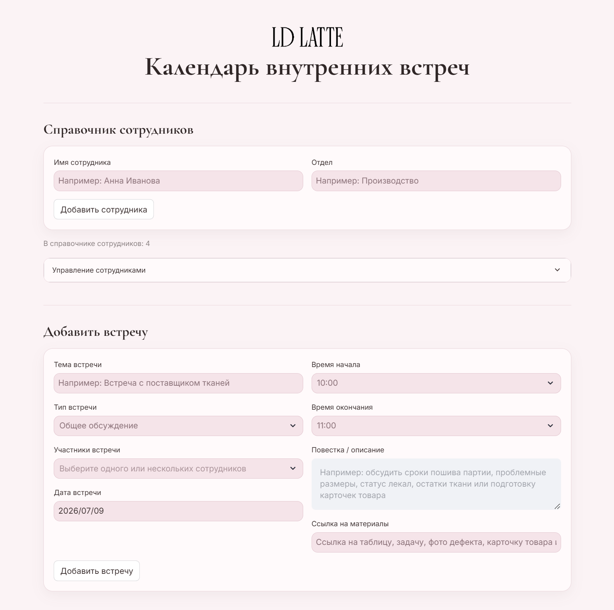
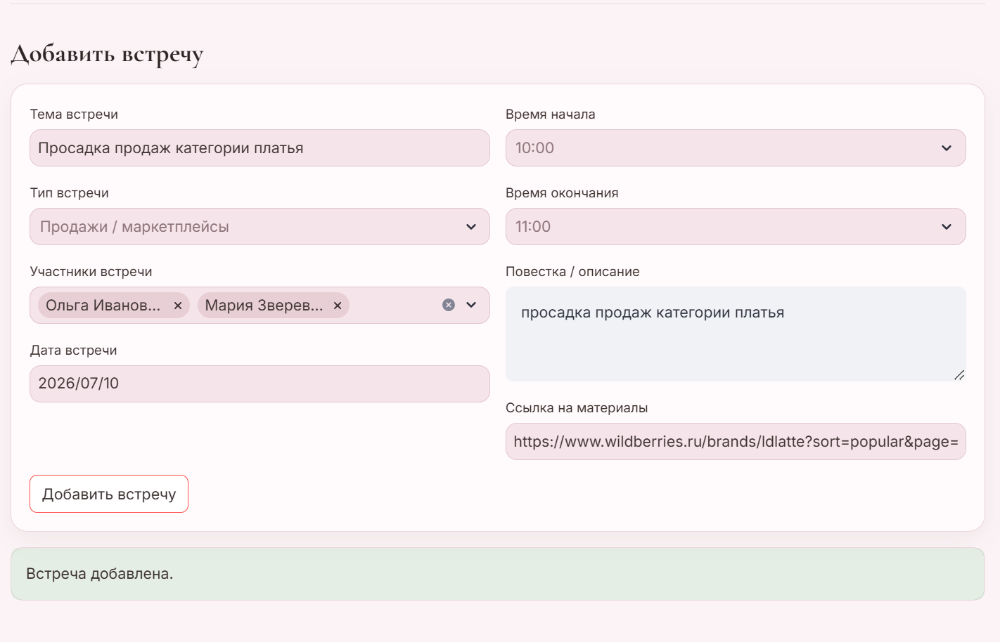
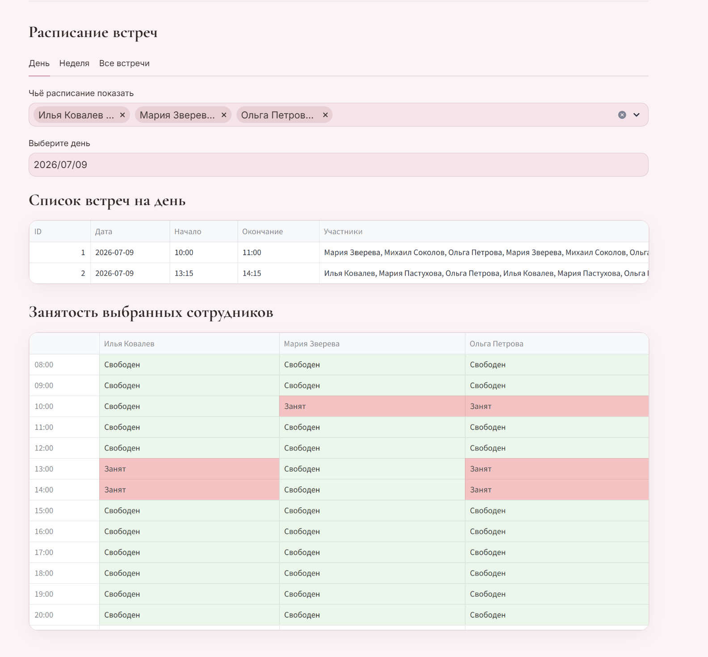
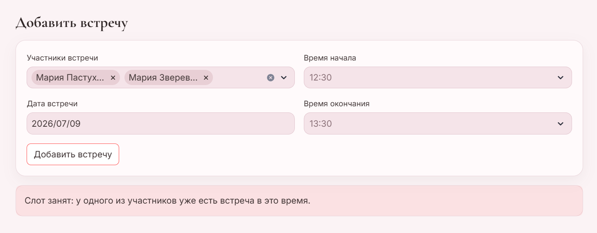

# LD LATTE — календарь внутренних встреч

Прототип внутреннего календаря встреч для сотрудников компании LD LATTE.

Приложение позволяет добавлять сотрудников, создавать встречи на двух и более участников, проверять занятость сотрудников и просматривать свободные слоты на день или неделю.

## Цель проекта

Задача тестового задания — создать инструмент, который помогает сотрудникам компании планировать встречи и не допускать пересечения по времени у участников.

В решении учтён масштаб компании: если в штате 60+ сотрудников, неудобно показывать расписание сразу по всем. Поэтому в приложении можно выбрать конкретных сотрудников и посмотреть только их занятость.

## Основная функциональность

- добавление сотрудников в справочник;
- указание отдела сотрудника;
- изменение отдела сотрудника;
- удаление сотрудника из справочника;
- создание встречи на двух и более участников;
- запрет создания встречи в прошлом;
- запрет создания встречи, если хотя бы один участник уже занят в выбранное время;
- просмотр встреч за выбранный день;
- просмотр встреч за выбранную неделю;
- просмотр всех встреч;
- фильтрация расписания по выбранным сотрудникам;
- визуальная сетка занятости: свободные и занятые временные слоты.

## Скриншоты

### Главный экран



### Создание встречи



### Расписание выбранных сотрудников



### Проверка конфликта по времени



## Логика проверки конфликтов

При создании встречи приложение проверяет:

1. выбрано минимум два участника;
2. время окончания позже времени начала;
3. дата и время начала встречи не находятся в прошлом;
4. у каждого выбранного участника нет другой встречи, которая пересекается по времени.

Если хотя бы один участник уже занят, встреча не создаётся.

## Почему участники выбираются из справочника

Вместо ручного ввода имён используется справочник сотрудников. Это защищает данные от ошибок вроде:
```
Анна / Аня / Anna / Анна Иванова
```
Так расписание и проверка занятости работают стабильнее.

## Технологии

- Python
- Streamlit
- SQLite
- pandas
- CSS

## Структура проекта

```
ld-latte-meeting-calendar/
├── assets/
│   └── logo.png
├── screenshots/
│   ├── main.png
│   ├── create-meeting.png
│   ├── schedule.png
│   └── conflict.png
├── app.py
├── database.py
├── styles.css
├── requirements.txt
├── README.md
└── .gitignore
```

## Как запустить локально

Клонировать репозиторий:
```Bash
git clone <repo-url>
cd ld-latte-meeting-calendar
```
Создать виртуальное окружение:
```Bash
python -m venv .venv
```
Активировать окружение на Windows:
```Bash
.\.venv\Scripts\Activate.ps1
```
Активировать окружение на macOS / Linux:
```Bash
source .venv/bin/activate
```
Установить зависимости:
```Bash
pip install -r requirements.txt
```
Запустить приложение:
```Bash
streamlit run app.py
```
После запуска приложение откроется в браузере:
```
http://localhost:8501
```

## Хранение данных

Данные хранятся локально в SQLite-базе:
```
meetings.db
```
База создаётся автоматически при первом запуске приложения и не добавляется в Git.

## Возможные улучшения
- авторизация сотрудников;
- роли администратора и обычного пользователя;
- импорт сотрудников из CSV;
- экспорт расписания в CSV;
- интеграция с Google Calendar;
- уведомления о встречах;
- поиск ближайшего общего свободного слота.
